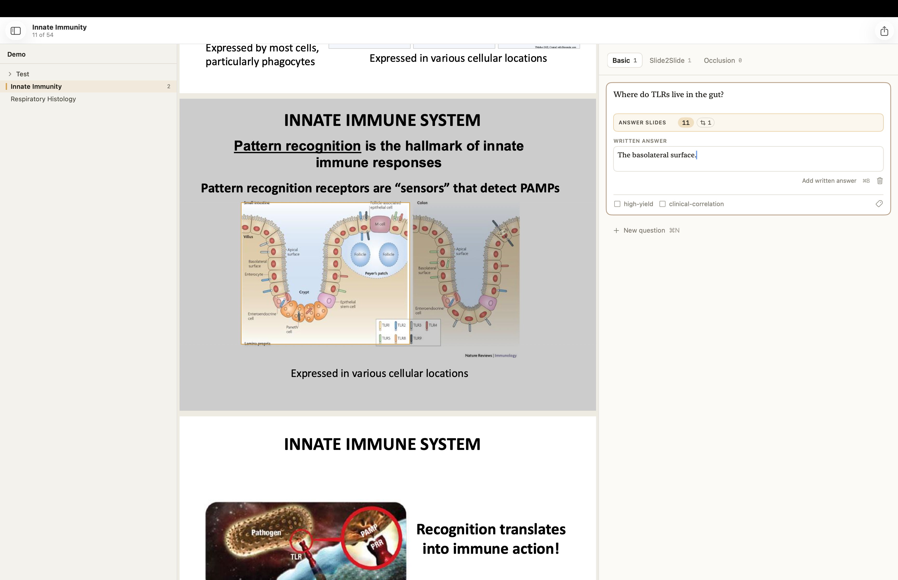
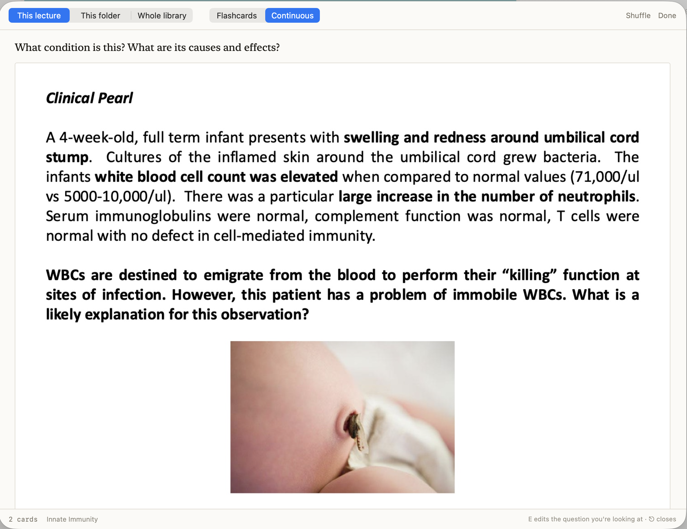
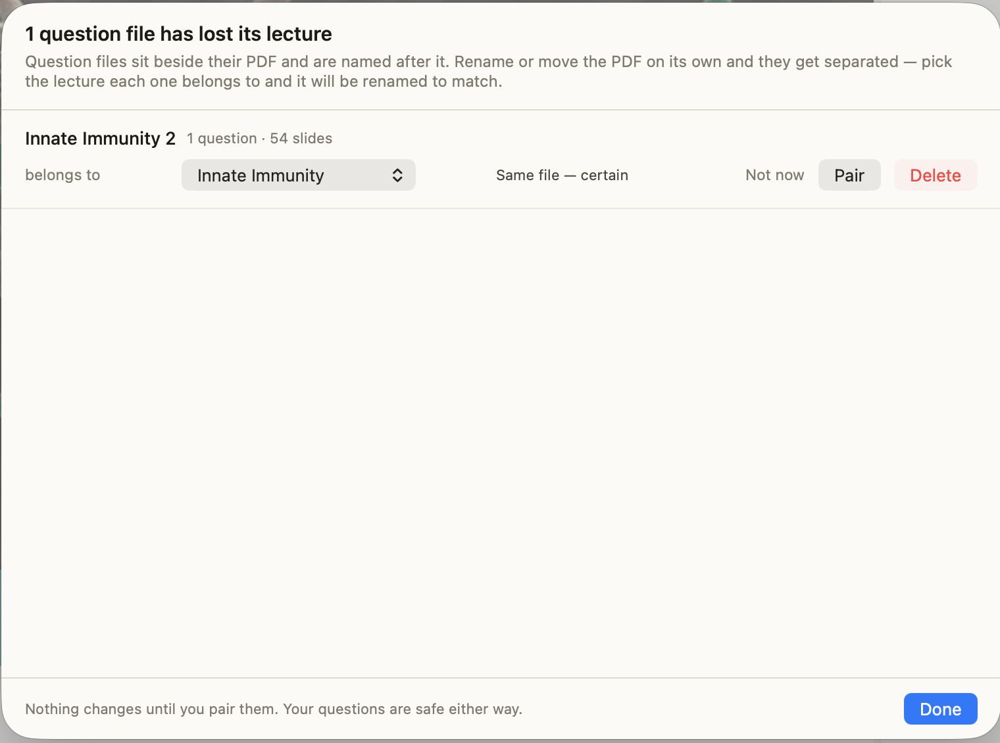

# AnkiFlow

**Turn lecture PDFs into Anki decks, fast.**

As you review a lecture, write big picture questions, and attach slides that answer them. From the app you can export directly to Anki — the front of the card is your question and the back is those slides, stacked so you can scroll through and check yourself. As you update your deck in AnkiFlow, you can reexport directly to Anki to update your cards.

Using keyboard shortcuts, you can create Anki decks with just a few key strokes, in just a few seconds.


<sub>macOS 14 or later · free · open source</sub>

---

## Contents

- [Install](#install)
- [Your first deck](#your-first-deck)
- [The core move](#the-core-move)
- [Kinds of card](#kinds-of-card)
- [Cropping a slide](#cropping-a-slide)
- [Editing the PDF](#editing-the-pdf)
- [Checking your cards before you export](#checking-your-cards-before-you-export)
- [Exporting](#exporting)
- [Send cards straight to Anki](#send-cards-straight-to-anki)
- [Finding things](#finding-things)
- [Where your work lives](#where-your-work-lives)
- [Keyboard](#keyboard)
- [Problems and ideas](#problems-and-ideas)

---

## Install

You'll need a Mac running macOS 14 or later, [Anki](https://apps.ankiweb.net) for the actual reviewing, and Apple's command line tools. If you've never installed those, open Terminal and run:

```bash
xcode-select --install
```

Then pick a folder to keep AnkiFlow in — your Documents folder is fine, anywhere you'll be able to find it again. **Whatever folder you're in when you run `git clone` is where AnkiFlow's code will live, and you'll need it again to update.** For example:

```bash
cd ~/Documents
git clone https://github.com/tasawwan/ankiflow.git
cd ankiflow/App
./make-app.sh --install
```

The first build takes a few seconds. When it finishes, AnkiFlow is in your Applications folder. Open it, then right-click its Dock icon ▸ Options ▸ Keep in Dock.

**To update later**, use **AnkiFlow ▸ Check for Updates**. If there's a new version it copies the update command to your clipboard and opens Terminal in the right folder — paste, press Return, and the app rebuilds and reopens itself.

---

## Your first deck

**1. Open your lectures.** File ▸ Open Library (⌘O), and choose the folder your PDFs live in. Subfolders become deck levels in Anki, so the folder tree you already have is the deck structure you get. Nothing is copied or moved — AnkiFlow reads your folder where it sits.

**2. Click a lecture** in the sidebar. The slides fill the middle; your questions go on the right.

**3. Write a question.** Press ⌘N, type it, and attach the slides that answer it (below).

**4. Export.** Press ⌘D.

---

## The core move

Every card has the same four fields, always on screen and all of them optional:

> **Question** → **Question slides** → **Answer** → **Answer slides**

**Tab moves between the two text fields, and the slide row you're attaching to follows your cursor.** In the question field, ⌘E and ⌘T fill the question slides. Tab to the answer and the same keys fill the answer slides. Nothing to click, no mode to remember.

You're reading slide 12, where a topic starts.

| | |
|---|---|
| **⌘N** | New question, cursor already in the question field |
| *type* | "What is the key function of respiration?" |
| **Tab** | Move to the answer — the answer slide row is now the armed one |
| **⌘↓** a few times | Read forward to slide 18 — **the slides scroll while your cursor stays in the text box** |
| **⌘E** | The answer slides become 12–18 |
| **⌘⏎** | Done. The card folds shut. |

Nothing is attached until you attach it — ⌘T for the slide you're on, ⌘E for a run from where you started.

No mouse, and no leaving the question you're typing. Fill as few of the four as you like — a card can be a question and some slides, and often that's all it is.

**When the slides aren't in a neat run:**

- **⌘T** adds or removes just the slide you're on, for the strays
- **⌘R** starts a fresh range here instead of extending the old one
- Or click the **Answer slides** row twice and type `12-18, 22` directly

---

## Kinds of card

Pick the kind at the top of the panel. It applies to the whole panel, so you're only ever making one kind at a time.

### Basic

Your question on the front, the attached slides on the back. This is most cards.

### Slide2Slide

The slides *are* the question. Optional text on the front lets you ask something specific about them — *"which step here is rate-limiting?"* — and other slides answer it.


Click either slide row to aim ⌘E and ⌘T at it. The armed row has an amber dot.

### Image Occlusion

Hide parts of a slide and recall them. Choose **Image Occlusion**, go to the slide, then **hold ⌥ and drag** over anything you want covered.


Two ways to turn that into cards:

- **All at once** — one card. The front hides everything; the back shows everything, with each region you'd covered boxed in amber, so you can see at a glance which parts you were meant to have recalled.
- **One at a time** — one card per region. The front hides everything with the region *that* card is asking about marked in amber; the back shows everything with that same region boxed.

The panel tells you how many cards you're about to make before you export.

Each region keeps its own review history, so you can add and remove regions later without disturbing the ones you've been studying.

### Cloze

A sentence with pieces blanked out. Type the line, select the part you want hidden, and press **⌘⇧C**.

> The **{{c1::classical}}** pathway is triggered by **{{c2::antibody}}** bound to antigen.

That makes two cards from one question — one hiding *classical*, one hiding *antibody* — and each keeps its own review history, so adding a third blank later doesn't disturb the two you've been studying.

Two buttons, because there are two things you might mean:

- **Hide selection** (⌘⇧C) — a card of its own.
- **Add to last card** — hidden at the same time as the blank before it, when two things only make sense together.

Slides attach to the back, the same way they do on a Basic card: the sentence tests you, and the slide is there to look at once you've answered. The answer field goes with them.

The panel tells you how many cards the question makes as you type. If nothing is hidden yet it says so — a cloze question with no blanks makes no cards at all, and AnkiFlow leaves it here rather than sending Anki a note you'd never see again.

### Your own question shapes

If you notice you're typing the same shape for a third time — *"A patient presents with ___. What is the diagnosis?"* — make it a template. Settings ▸ Templates ▸ New Template, then select a phrase and press ⌘B to turn it into a blank.


**Slides on** decides whether cards from that template carry their slides on the front, the back, or both. Deleting a template turns its questions into Basic ones, keeping the text exactly as it reads — nothing is lost.

---

## Cropping a slide

Sometimes you only want one figure from a busy slide. **Hold ⌥ and drag** on the page: everything outside the rectangle dims, and when you let go the card will show just that region.



A cropped slide is outlined on the page, and the slide row counts them — click that badge to see which slides are cropped and remove any of them. Use the slide controls to remove the crop on the slide you're looking at.

The crop belongs to whichever slide row is armed, so the same slide can be cropped one way on a card's front and another on its back.

**Cropping never modifies your PDF.** The crop is four numbers in the question file, and it's stored as a proportion of the page — so it stays correct even if you keep annotating the PDF in another app. (The one place AnkiFlow does write to your PDF is the PDF menu, below, and it says so on screen while you're in it.)

---

## Editing the PDF

Everything above leaves your lecture file untouched. This doesn't — it's the one part of AnkiFlow that writes to the PDF itself, which is why it announces itself while you're in it.

**Edit PDF** at the top of the slide pane turns it on (or **PDF ▸ Edit PDF…**). The button becomes a row of tools laid out like Preview's markup bar. **Esc** or **Done** puts it away.


**Nothing is written until you say so.** Marks appear as you make them, but they live in memory until you press **⌘S** (or the **Save** button, which appears the moment there's something to save). **⌘Z** undoes the last PDF edit and **⇧⌘Z** redoes it. Leaving with unsaved marks asks first.

Text boxes appear at a default size when clicked. Select a text box to change its color, fill, size, bold, or italic style; selecting part of its text applies bold or italic only to that selection. These settings remain the defaults for the next text box.

While editing a text box, **⌘B** toggles bold, **⌘I** toggles italic, and **⌘U** toggles underline. **⌘Z** undoes the last PDF edit and **⇧⌘Z** redoes it. Text-box formatting remains visible after you click away and when you view the PDF.

**Marking up a slide.**

| Tool | |
|---|---|
| **Select text** | Then click Highlight, Underline or Strikethrough |
| **Select** | Click a mark to pick it up. Drag to move it, drag a corner to resize, ⌫ to delete. Double-click a text box to retype it — including one you saved weeks ago |
| **Sketch** | Draw freehand |
| **Shapes** | Rectangle, oval, line, arrow. Click for the last one you used, hold for the rest |
| **Text** | Click to place a default-size box, then type; resize the box if needed |
| **Trim** | Drag to cut the slide down to that rectangle |

The swatch next to them holds the stroke colour, the fill (or no fill), the line thickness and the text size. Changing the colour with something selected recolours it.

Marks are real PDF annotations, so they show up in Preview, GoodNotes, or wherever else you read the file — and because they're part of the page, they appear on every card that uses that slide.

**Rearranging slides.** Rotate, insert and delete are behind the pages button in the bar, and in the PDF menu. Drag slides in the gallery to reorder them. Reordering is held in memory with your other PDF edits and is written only when you click Save; undo or discard works before then. When slides move, **your questions move with them**.

Deleting a slide is the only action here that asks first. Everything else you can put back by doing the opposite; a deleted page is gone from the file.

**Trimming.** After trimming one slide, **Trim Every Slide Like This One** applies the same margins to the whole lecture — a deck exported with the same header on all sixty slides gets fixed once. Trimming moves the page's edges, so anything you've already cropped or masked on those slides is re-measured against the new ones and keeps pointing at the same part of the picture.

After any of this, your slide images re-render and the affected cards update in Anki on the next export. Your review history is untouched.

---

## Checking your cards before you export

Press **⌘P**. You see your cards the way they'll appear, drawn by the same code that builds the deck — and it opens on the card you were just working on, so checking the one you've written is one keystroke rather than a scroll.



This catches things that are invisible in the panel: a crop that clipped a label, a mask over the wrong structure, a range that took 12–18 when you meant 12–8. Press **E** on any card to jump straight to that question and fix it.

Two ways through: **flashcards**, where Space reveals the answer and then moves on, or **continuous** — one long scroll of question, slides, a rule, then the answer and its slides.

Nothing is graded and nothing is saved here. Anki does the spaced repetition. However, this is a great way to quickly move through the lectures.

---

## Exporting

Press **⌘D**.


Choose how much to export — this lecture, this folder, or everything — and where it should go.

**The important part is the second time.** Add questions to a lecture, export again, and Anki **updates your existing cards while keeping every interval, due date and ease**. Only questions that genuinely changed get rewritten, and the export window tells you how many.


If you're importing a `.apkg` file by hand, leave Anki's **Update notes** on *If newer* and tick **Merge notetypes**. The export window reminds you.

### Two things Anki can't do

Neither is a bug — it's how importing works — so AnkiFlow tells you rather than hiding it.

**Cards never change deck.** Reorganise your folders and cards you've already studied stay where they first landed. The export window gives you a search to paste into Anki's browser: select them all, then Change Deck.

**Deleting a question doesn't delete its card.** AnkiFlow remembers what you removed and hands you a search for exactly those cards — or, if Anki is running, deletes them for you.

---

## Send cards straight to Anki

**This is the way to do it.** Choose **Straight into Anki** in the export window and your cards appear in Anki immediately — no save dialog, no file to find, no import screen, no checkboxes to get wrong. It's the same cards either way; it just removes every step where something can go wrong, and it means the "If newer / Merge notetypes" settings can never be set wrongly by accident.

It needs a free add-on called AnkiConnect. Once, in Anki:

1. **Tools ▸ Add-ons ▸ Get Add-ons…**
2. Paste in this code: **`2055492159`**
3. Click OK, then restart Anki

That's it. Leave Anki running when you export and AnkiFlow will find it. If Anki is closed, the export window says so and falls back to saving a file, which always works.

---

## Finding things

| | this lecture | everywhere |
|---|---|---|
| **slides** | ⌘F | ⇧⌘F |
| **your questions** | ⌥F | ⌥⌘F |

⌘F searches the slides of the lecture you have open and jumps to the hit — what you want while writing a question. The library-wide searches show you which lectures match, and you click through to the hits.

---

## Where your work lives

Nothing is hidden in a database.

```
YourLectures/                    ← the folder you opened
├── Immunology/
│   ├── Lecture 04.pdf
│   └── Lecture 04.ankiflow.json ← your questions for that lecture
└── .ankiflow/                   ← settings, image cache, undo history
```

Your questions sit next to the PDF they belong to, as plain readable text. They're hidden in Finder by default (press ⇧⌘. to see them), and a lecture with no questions gets no file at all.

**Questions save automatically.** PDF markup and slide reordering are separate: while editing a PDF, click Save to write those changes into the PDF. ⌘⏎ finishes a question and folds it shut; ⌘Z undoes, ⇧⌘Z redoes, and question history survives quitting the app.

**Renaming and moving lectures.** Do it inside AnkiFlow — **drag a lecture onto a folder** to move it, and right-click for Rename or Move to Trash — and your questions travel with the PDF. If you do move a PDF in Finder and leave its questions behind, AnkiFlow notices next time it scans the library and offers to put them back together, showing you which lecture it thinks they belong to and why.



**If you annotate your slides**, that's fine and expected — the app re-renders them for your next export. **If you add or delete a slide**, AnkiFlow notices that too, works out where each of your slides went by what it says, and asks you to confirm before renumbering your questions. Slides with no text on them are worked out from their neighbours, and it always asks about those.

**Flagging slides.** Click the bookmark in the edit bar to flag or unflag the current page. Flags are saved directly in the PDF, are not part of your question sidecar, and are hidden from exported card images. Use **View ▸ Show Flagged Pages Only** to limit the gallery and ⌘↓/⌘↑ navigation to flagged pages.

---

## Keyboard

Every one of these is a menu command, so they work while your cursor is in a text box.

| Key | |
|---|---|
| ⌘N | New question |
| Tab / ⇧Tab | Question field ⇄ answer field — the armed slide row follows |
| ⌘↓ ⌘↑ | Next / previous slide — **works while typing**; follows the flagged-pages filter |
| ⌘E | Extend the range to the slide you're on |
| ⌘T | Add or remove just this slide |
| ⌘R | Start a new range here |
| ⌥-drag | Crop a slide, or hide a region on an occlusion card |
| ⌘⏎ | Finish this question |
| ⌘⇧C | Hide the selected words on a cloze card |
| ⌘⌫ | Delete this question |
| ⌘U | Underline selected text while editing a PDF |
| ⌘Z / ⇧⌘Z | Undo / redo — your questions, or your PDF edits while editing |
| ⌘B / ⌘I | Bold / italicize selected text while editing a PDF |
| ⌘S | Save your marks into the PDF (while editing) |
| ⌘Y | Switch card kind |
| ⌘P | Preview your cards |
| ⌘D | Export |
| ⌘O | Open a different folder of lectures |
| ⌘F ⇧⌘F ⌥F ⌥⌘F | Find (Search local slides, library slides, local questions, library questions)|
| ⌘1 ⌘2 | Sidebar / slide gallery |
| View ▸ Show Flagged Pages Only | Limit navigation and the gallery to bookmarked pages |
| ⌘? | This documentation, inside the app |

---

## Problems and ideas

**[Open an issue on GitHub](https://github.com/tasawwan/ankiflow/issues)** for either one:

- **Bug reports** — something crashed, exported wrong, or didn't do what this page says it does. Say what you did, what happened, and what you expected instead.
- **Feature requests** — a card type you want, a step that takes too many clicks, anything missing. These are genuinely welcome.

Both go in the same place, and it means other people with the same problem or the same idea can find it.

Your questions are safe whatever happens to the app: they're plain files next to your PDFs, and deleting or reinstalling AnkiFlow doesn't touch them.

---

MIT licence. © 2026 Tasawwar Rahman.
